<h1 align="center">💚 FBoard 💚
    <h3 align="center">✨ A fork of the Florigboard theme ✨</h2>
</h1>
<h3 align="center">A set of <a href="https://m3.material.io/">Material You</a> themes for the FlorisBoard keyboard. </h3>

    

      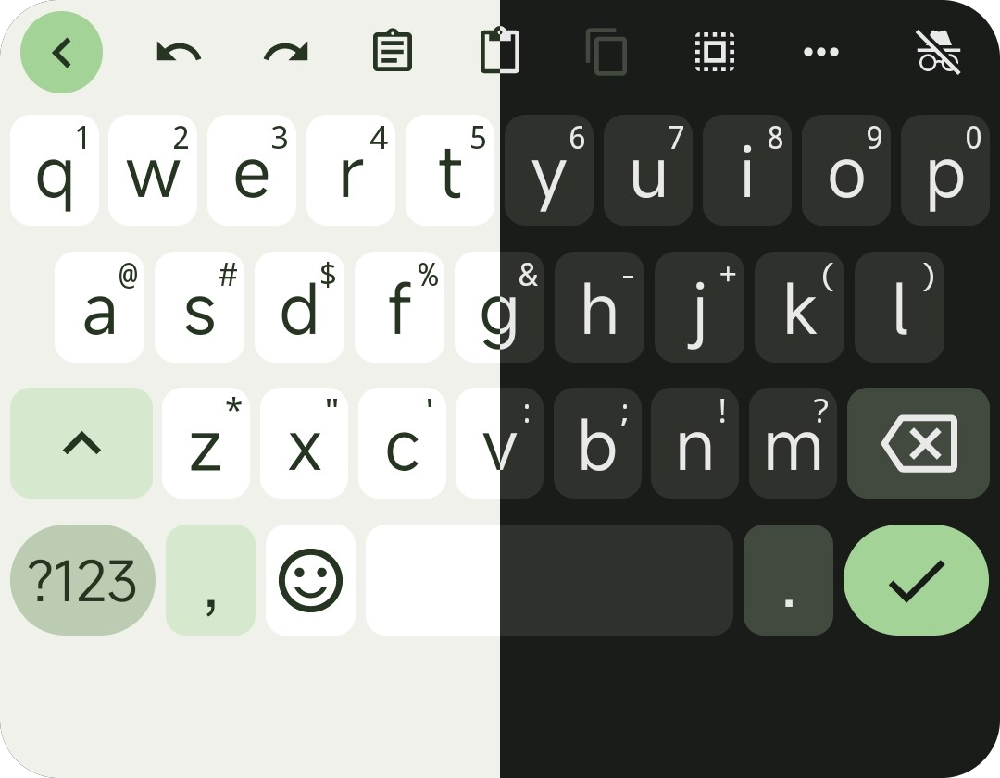
      &nbsp;&nbsp;&nbsp;&nbsp;
      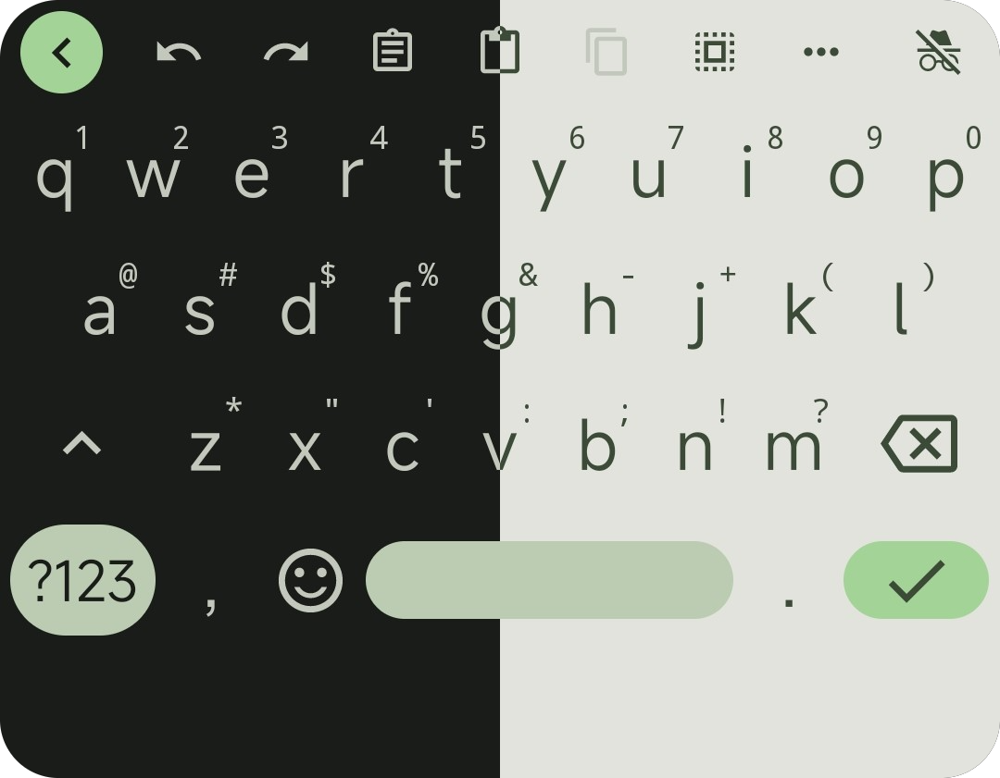
      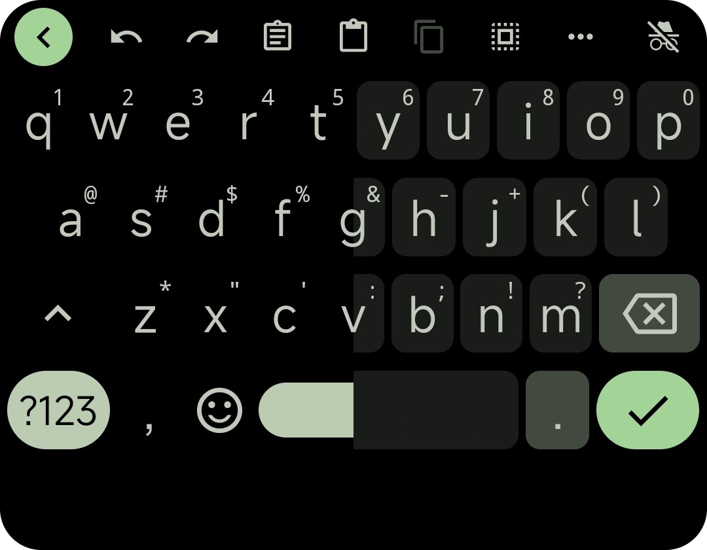
    

<h2>🖼️ More Screenshots

    
-   While all of these themes are examples based on a single color palette, the themes themselves are <b>dynamic</b>. So they are built on Material You introduced in <b><a href="https://en.wikipedia.org/wiki/Android_12">Android 12</a></b>, which generates a <b>dynamic palette based on the user's home wallpaper</b>.

    

      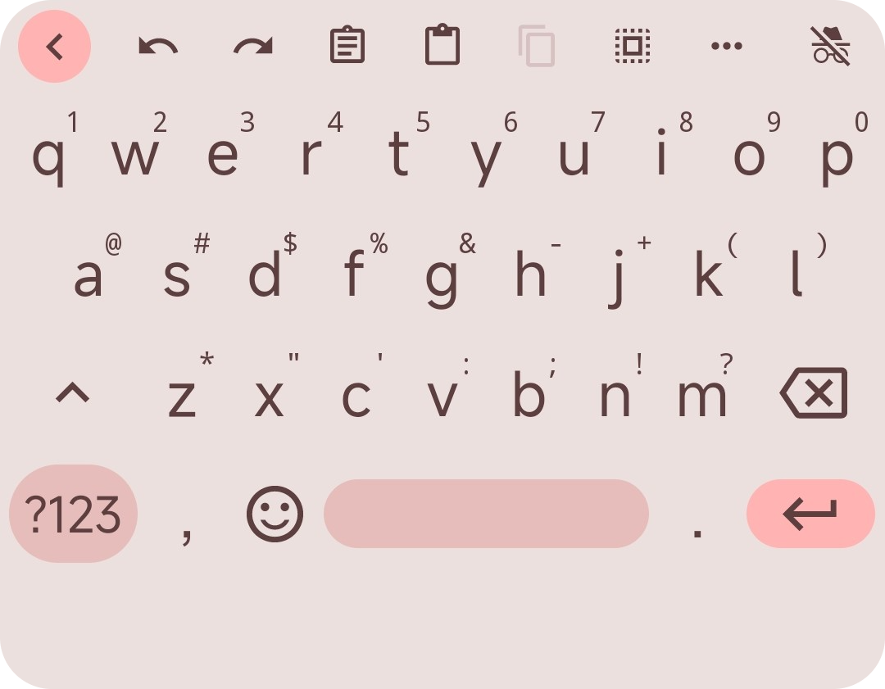
      &nbsp;&nbsp;&nbsp;&nbsp;&nbsp;
      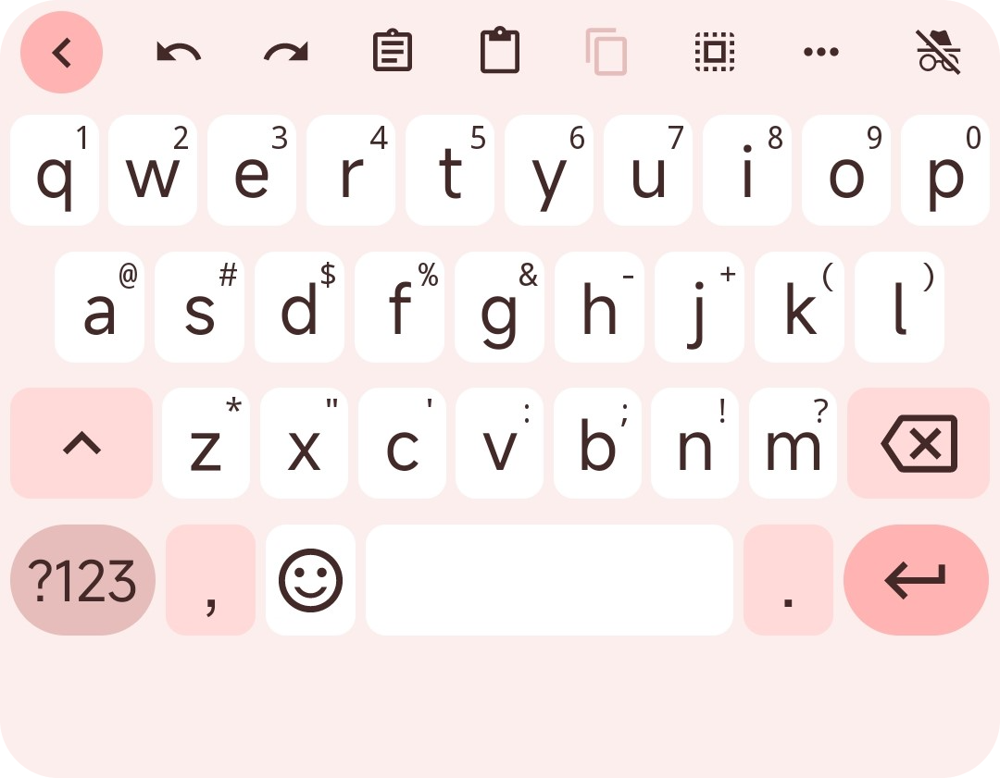
    

    &nbsp;&nbsp;&nbsp;&nbsp;&nbsp;
    

      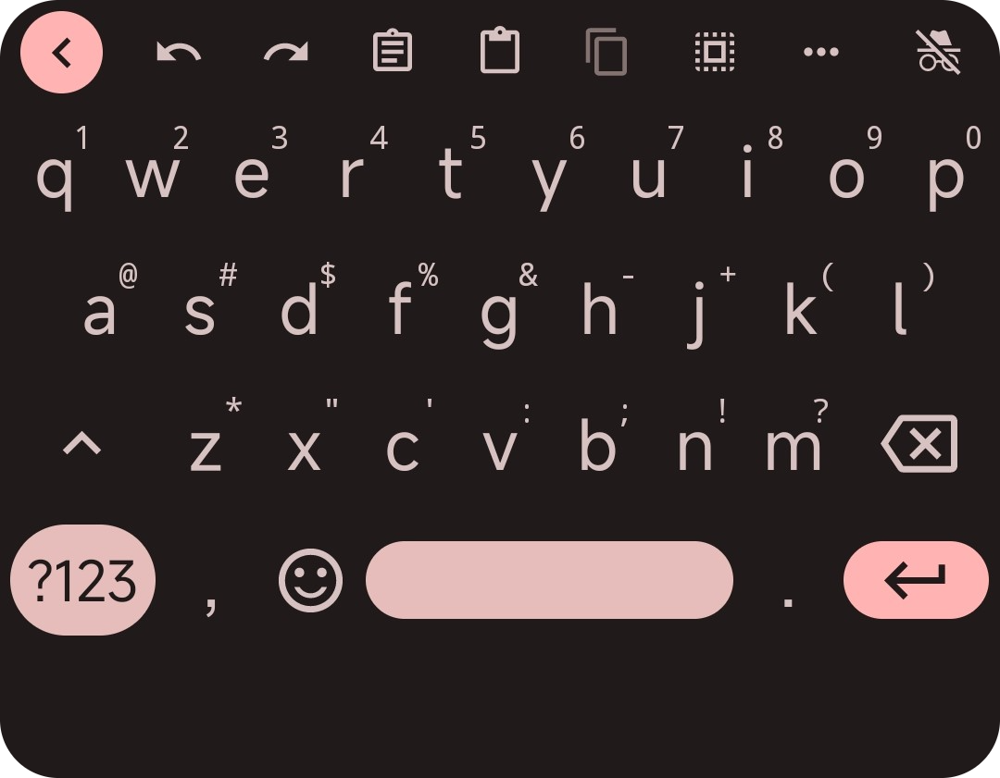
      &nbsp;&nbsp;&nbsp;&nbsp;&nbsp;
      
    

     &nbsp;&nbsp;&nbsp;&nbsp;&nbsp;
    

      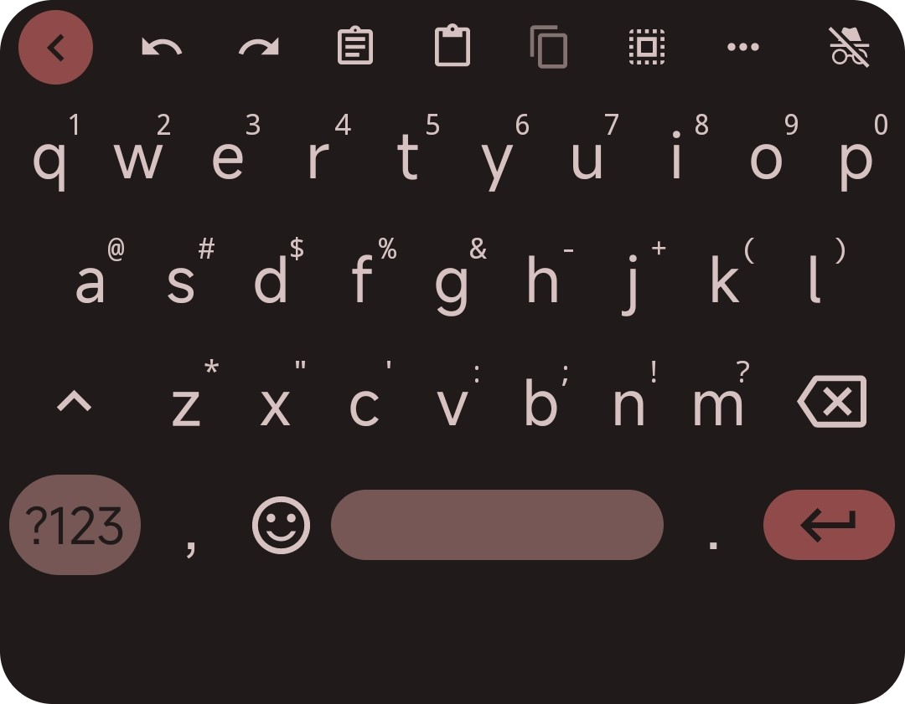
      &nbsp;&nbsp;&nbsp;&nbsp;&nbsp;
      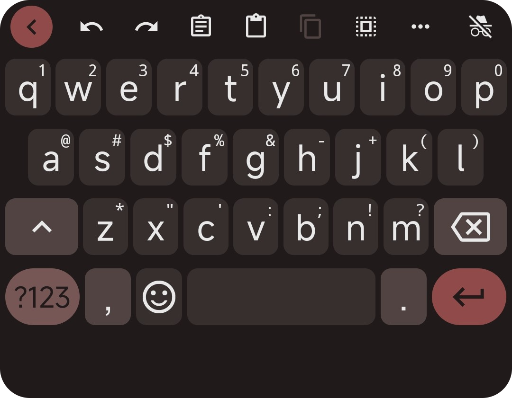
    

     &nbsp;&nbsp;&nbsp;&nbsp;&nbsp;
    

      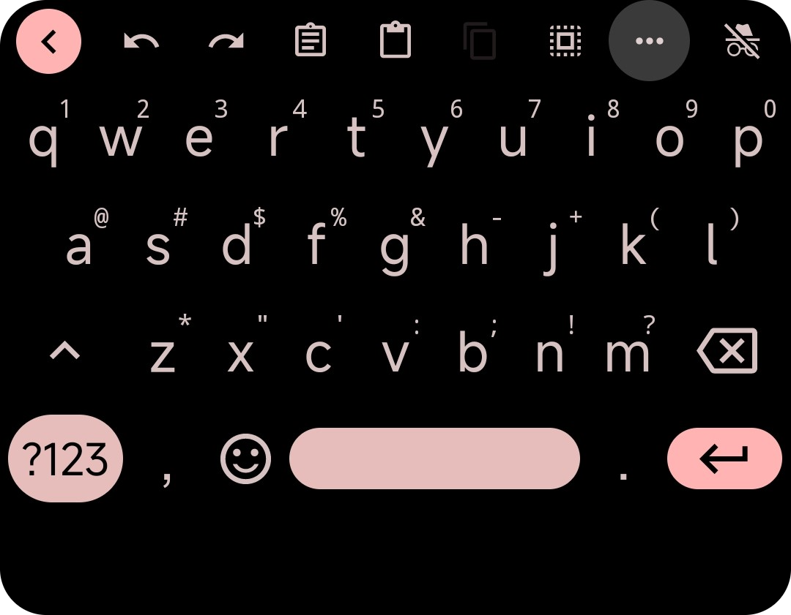
      &nbsp;&nbsp;&nbsp;&nbsp;&nbsp;
      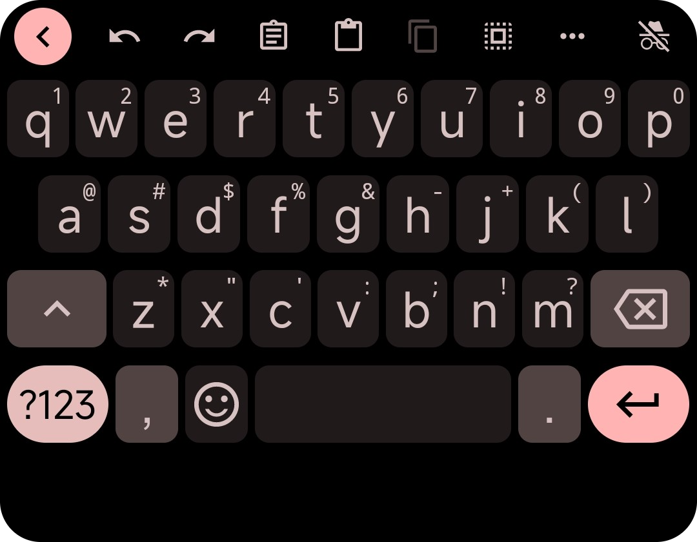
    

     &nbsp;&nbsp;&nbsp;&nbsp;&nbsp;
    

      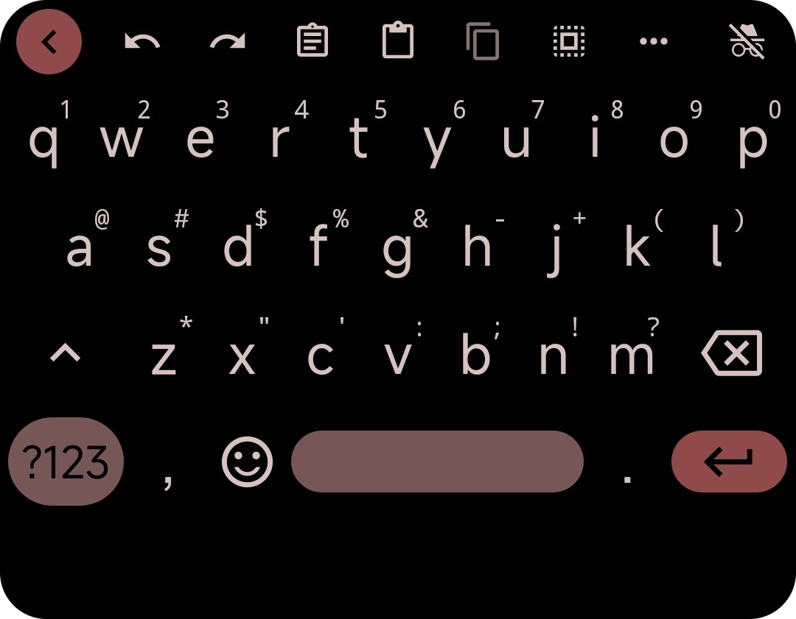
      &nbsp;&nbsp;&nbsp;&nbsp;&nbsp;
      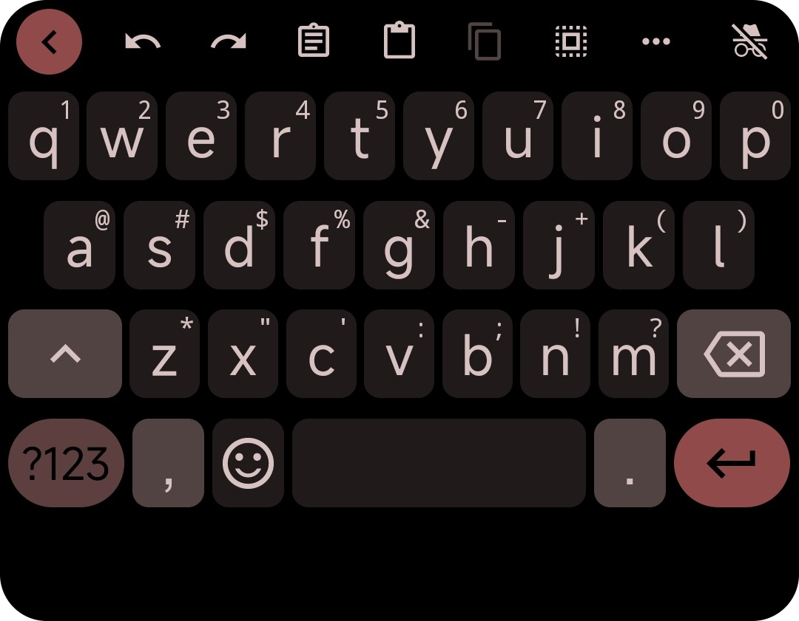
    

      &nbsp;&nbsp;&nbsp;&nbsp;&nbsp;

## ❗ Required

-   **IT IS REQUIRED TO USE THIS VERSION OF FLORISBOARD:** [Material You Florisboard Version](https://github.com/florisboard/florisboard/suites/17812626523/artifacts/1021315804)<code>debug</code>
    - Other Mirror links: [#1](https://github.com/itsmartashub/florigboard/releases), [#2](https://github.com/florisboard/florisboard/suites/17812626523/artifacts/1021315804), [#3](https://github.com/TeaOwO/Gboard-for-Florisboard-theme/releases/download/v3.5.3/MaterialYou_v3.5.2.flex), [#4](https://www.mediafire.com/file/pywec1eo0iqze0j/dev.patrickgold.florisboard.debug.apk/file)
- Credits to  <a href="https://github.com/1fexd">1fexd </a> for making this possible!

## 🎨 Themes <b><code>10</code></b>

-   ☀️ **LIGHT** (Border/Borderless)
-   🌒 **DARK** (Border/Borderless)
-   🌑 **DARKER** (Border/Borderless)
-   ⚫ **AMOLED** (Border/Borderless)

## ⚙️ Setup

-   Open the **FlorisBoard Debug** app 
     - (it's important to install one of these [`.apk`](https://github.com/TeaOwO/Florigboard-fork/edit/Main/README.md#-important))
- Click on `Theme` &rarr; `Manage installed themes`
- Click on `Import` &rarr; `Select files`
- Select the `flex` file you have downloaded (`gboardish.flex`)
- You should see **10** new themes.
- Go back to `Theme`, and then press `Selected theme` to select the theme you prefer for `☀️ Day` and `🌙 Night`

## ⚠️ Disclaimers

- My involvement is limited to the creation of themes (`gboardish.flex` file). I do not engage in alterations to the [source code](https://github.com/1fexd/florisboard/tree/feature/material-you-theme-colors) nor initiate FlorisBoard `commits`.
- The provided `florisboard-0.4.0-debug-MYD.apk` file represents a `debug` version of [FlorisBoard](https://github.com/florisboard/florisboard). Please anticipate the presence of bugs and anomalies in its functionality.
- The themes have been tested on **Android 12 and 13**. Material You **is not supported** on any OS version lower than Android 12. However, I could create a few **static** themes that resemble Gboard.

## 📖 Credits

-   [FlorisBoard](https://github.com/florisboard/florisboard) is a remarkable free and open-source keyboard developed by [patrickgold](https://github.com/patrickgold).
-   The `app-debug.apk` [[link](https://github.com/florisboard/florisboard/suites/17812626523/artifacts/1021315804)] file for this project has been enriched with captivating [Material Design features](https://github.com/1fexd/florisboard/tree/feature/material-you-theme-colors), thanks to the creative touch of   <a href="https://github.com/1fexd">1fexd </a>. Big thanks for making dynamic themes possible 🙏
-   I want to extend a big thank to the brilliant developer behind the ingenious, unique, feature-rich **FlorisBoard Theme Editor** especially – [patrickgold](https://github.com/patrickgold). His outstanding invention make it possible to create custom themes. His exceptional work is truly greatly appreciated. 💖
