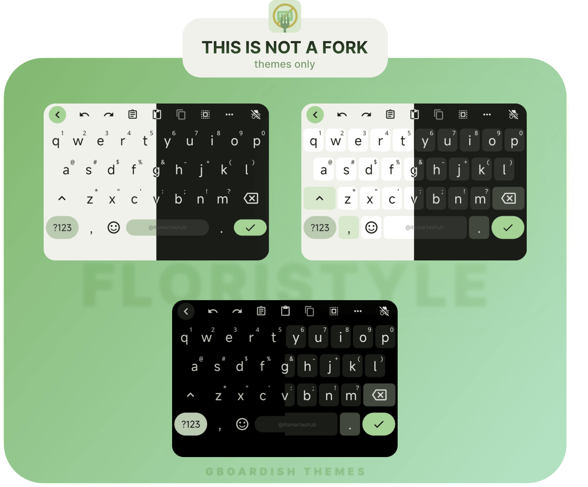
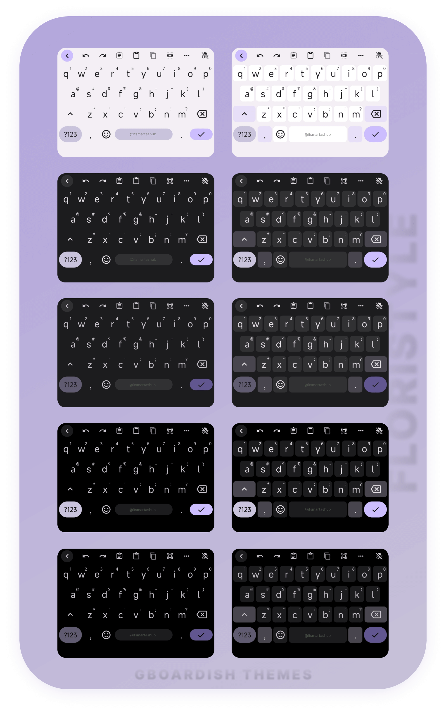

<h1 align="center">FLORISTYLE</h1>
<h2 align="center">Gboardish your Florisboard with Material You themes.</h2>

 

    

      
    

    

        

            <b>MORE SCREENSHOTS</b>
        

&nbsp;

While all of these themes are examples based on a single color palette, the themes themselves are <b>dynamic</b>. So they are built on Material You introduced in <b>Android 12</b>, which generates a <b>dynamic palette based on the user's home wallpaper.</b>

    

 

## Setup

1.  Open the **Florisboard** app
2.  Click on `🧩 Addons & Extensions`
3.  Click on `Import` ➡️ `Select files`
4.  Select the `flex` file you have downloaded `gboardish-v4.0.0.flex` and later
5.  You should see the preview content of the `flex` file. Press `Import`
6.  Go back to the main page, press `🎨 Theme ` and then select the theme you prefer for `☀️ Day theme ` and `🌙 Night theme `

## Themes (`14`)

-   ☀️ **LIGHT** (Border/Borderless)
-   🌙 **DARK** (Border/Borderless)
-   🌑 **AMOLED** (Border/Borderless)

>[!TIP]
>If you feel overwhealmed or bloated with so many floristyle themes, please feel free to delete unused ones by navigating to: 
>
> `🧩 Addons & Extensions` > `🎨 Theme extensions` > `Edit` for the `FloriStyle themes` section, then in listed `Bundled themes` press `Delete` for the themes you would like to remove.

## Change sticky action key
- If you're not using mic for a sticky key, but some other action key, and you still want it to look like Gboard mic, see small guide how to change it in `Steps`.
- For better context, see Florisboard issue [#2330](https://github.com/florisboard/florisboard/issues/2330) where point `2` is
  
### Steps

- Open the theme you want to edit in theme editor
- Scroll to "**Smartbar Action Key**" where is `code = [-233]` (that's a mic key code)
- Press edit icon ✏️  |  `01`
- In "**Target key codes**" press on plus sign ➕  |  `02`
- Type in the code key you set for the sticky key. If you don't know which one it is, click on the magnifying glass icon 🔍, which should be flashing now, indicating that you are in 'key recording' mode. Then, press the key whose code you want to find out, for example, incognito  |  `03`
- When you select the desired key, press "**Add**"  |  `04`
- You should now have two keycodes. Press `-233` to open a pop-up to remove the mic design  |  `05`
- Press "**Delete**"  |  `06`
- Press "**Apply**" to apply design to your selected sticky key  |  `07`

&nbsp;&nbsp;&nbsp;&nbsp;

## Credits

[Florisboard](https://github.com/florisboard/florisboard), a powerful and feature-rich open-source Android keyboard, is developed and maintained by the talented [@patrickgold](https://github.com/patrickgold) with the invaluable support of an incredible team of [contributors](https://github.com/florisboard/florisboard/graphs/contributors). I’m truly grateful for their hard work and the time they’ve invested in this project.  

Special thanks to [@1fexd](https://github.com/1fexd) for implementing the **Material You** feature into **Florisboard Theme Editor**, which brings dynamic themes to life. And once again, much appreciation to [@patrickgold](https://github.com/patrickgold) for the **Florisboard Theme Editor**, a brilliant tool for customizing themes and unlocking creativity.
