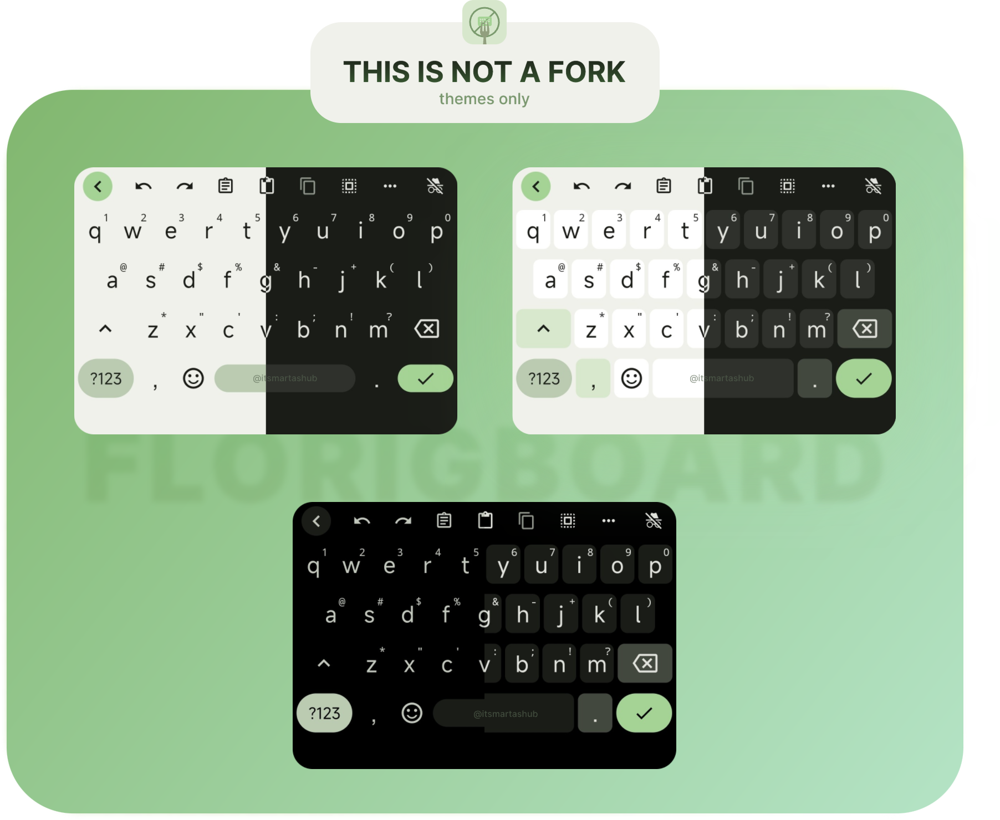
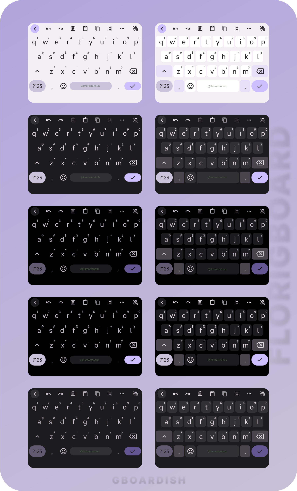

<h1 align="center">Gboardish Florisboard</h1>
<h2 align="center">Material You themes for the Florisboard keyboard. </h2>
  

    

      
    

<h2> More Screenshots

    
-   While all of these themes are examples based on a single color palette, the themes themselves are <b>dynamic</b>. So they are built on Material You introduced in <b>Android 12</b>, which generates a <b>dynamic palette based on the user's home wallpaper</b>.

  

## Important

⚠️ **TO MAKE THIS WORK IT IS CRUCIAL TO USE `apk` FILE ATTACHED IN [RELEASES](https://github.com/itsmartashub/florigboard/releases/)**.

-   This represents a [`debug` Florisboard version](https://github.com/florisboard/florisboard/actions/runs/5039154715?pr=2213) in which the [Material Design features](https://github.com/1fexd/florisboard/tree/feature/material-you-theme-colors) has been integrated by [@1fexd](https://github.com/1fexd).

-   Once [@patrickgold](https://github.com/patrickgold) officially merges [@1fexd](https://github.com/1fexd)'s Material You feature into future updates and make release with it implemented, the `apk` file from here **will be removed**.

-   I encourage you to build your own `apk` from the [source code](https://github.com/1fexd/florisboard/tree/feature/material-you-theme-colors). I merely placed that version [**here**](https://github.com/itsmartashub/florigboard/releases/) to keep things together!

## Setup

**1.** Open the **FlorisBoard Debug** app [it's important to install [this](https://github.com/itsmartashub/florigboard/releases/v2.0.0) `apk` version]  
**2.** Click on `Theme` ➡️ `Manage installed themes`  
**3.** Click on `Import` ➡️ `Select files`  
**4.** Select the `flex` file you have downloaded `gboardish.flex`  
**5.** You should see `10` new themes.  
**6.** Go back to `Theme`, and then press `Selected theme` to select the theme you prefer for `☀️ Day theme ` and `🌙 Night theme `

## Themes (10)

-   ☀️ **LIGHT** (Border/Borderless)
-   🌓 **DARK** (Border/Borderless)
-   🌒 **DARKER** (Border/Borderless)
-   🌑 **AMOLED** (Border/Borderless)

## Warnings

-   As a Material You themes creator, my involvement is limited to the creation of themes [`gboardish.flex` file]. I do not engage in alterations to the [source code](https://github.com/1fexd/florisboard/tree/feature/material-you-theme-colors) nor initiate FlorisBoard `commits`.
-   The provided `florisboard-0.4.0-debug-MYD.apk` file represents a `DEBUG` version of [Florisboard](https://github.com/florisboard/florisboard). Please anticipate the presence of bugs and anomalies in its functionality.
-   The themes have been tested on **Android 12** and **13**.

## Credits

-   [Florisboard](https://github.com/florisboard/florisboard) is a remarkable free and open-source android keyboard developed by [@patrickgold](https://github.com/patrickgold).
-   The [`apk`](https://github.com/florisboard/florisboard/actions/runs/5039154715/job/13643367775?pr=2213) file for this project has been enriched with captivating [Material Design features](https://github.com/1fexd/florisboard/tree/feature/material-you-theme-colors), thanks to the creative touch of [@1fexd](https://github.com/1fexd) [[LinkSheet](https://github.com/1fexd/LinkSheet) App Creator]. Big thanks for making dynamic themes possible.
-   I want to express my sincere gratitude to the brilliant developer behind the ingenious, unique, feature-rich **Florisboard Theme Editor** especially – [@patrickgold](https://github.com/patrickgold). His outstanding invention make it possible to create custom themes. His exceptional work is immensely appreciated.
