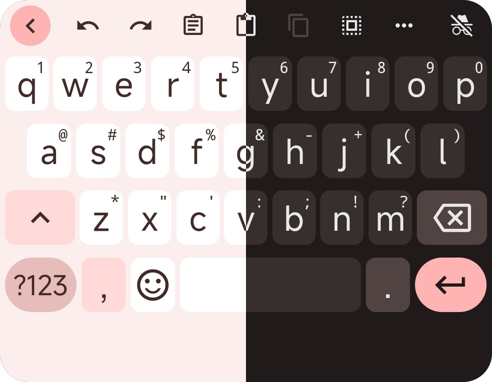
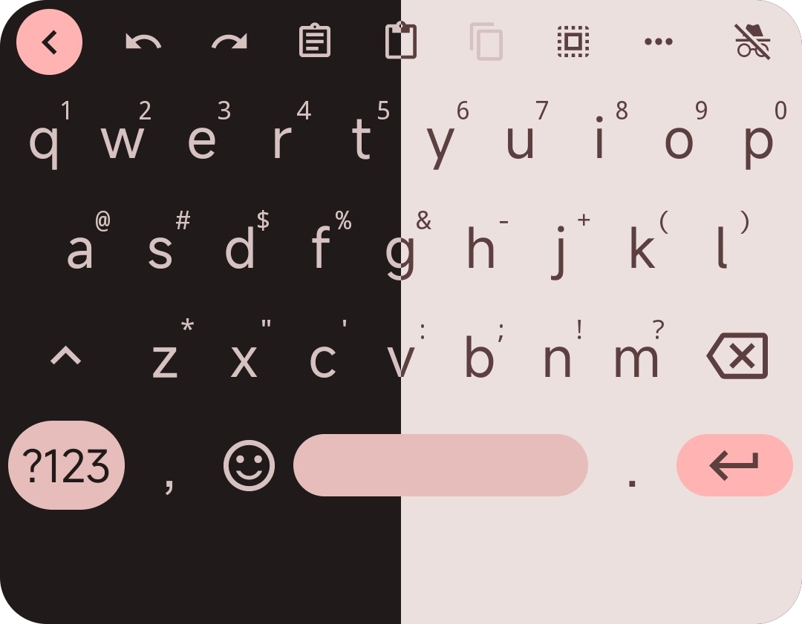
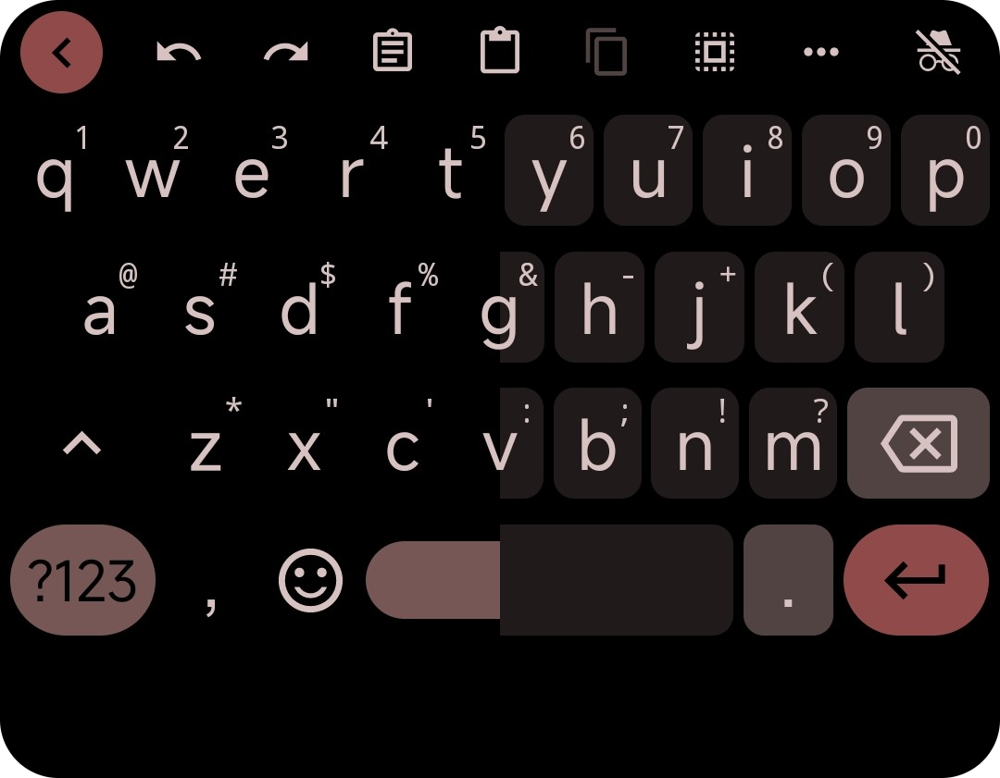

<h1 align="center">Gboard-ish FlorisBoard -🐞DEBUG🐞</h1>
<h3 align="center">Material You themes for the FlorisBoard keyboard. </h3>

    

      
      &nbsp;&nbsp;&nbsp;&nbsp;
      
       &nbsp;&nbsp;&nbsp;&nbsp;
      
    

<h2>🖼️ More Screenshots  &nbsp;&nbsp;&nbsp;&nbsp;👉<b>[CLICK ME]</b>👈</h2>

-   While all of these themes are examples based on a single color palette, the themes themselves are <b>dynamic</b>. So they are built on Material You introduced in <b>Android 12</b>, which generates a <b>dynamic palette based on the user's home wallpaper</b>.

    

      
      &nbsp;&nbsp;&nbsp;&nbsp;&nbsp;
      
    

    &nbsp;&nbsp;&nbsp;&nbsp;&nbsp;
    

      
      &nbsp;&nbsp;&nbsp;&nbsp;&nbsp;
      
    

     &nbsp;&nbsp;&nbsp;&nbsp;&nbsp;
    

      
      &nbsp;&nbsp;&nbsp;&nbsp;&nbsp;
      
    

     &nbsp;&nbsp;&nbsp;&nbsp;&nbsp;
    

      
      &nbsp;&nbsp;&nbsp;&nbsp;&nbsp;
      
    

     &nbsp;&nbsp;&nbsp;&nbsp;&nbsp;
    

      
      &nbsp;&nbsp;&nbsp;&nbsp;&nbsp;
      
    

      &nbsp;&nbsp;&nbsp;&nbsp;&nbsp;

## 💥 Important

-   To make this work it is important to use [this](https://github.com/florisboard/florisboard/actions/runs/5039154715/job/13643367775?pr=2213) `debug` FlorisBoard version in which the [Material Design features](https://github.com/1fexd/florisboard/tree/feature/material-you-theme-colors) has been integrated by 🐦[1fexd](https://github.com/1fexd)🐦.
-   I encourage you to get the `apk` directly from the [Github Actions](https://github.com/florisboard/florisboard/actions/runs/5039154715/job/13643367775?pr=2213) or build your own from the [source code](https://github.com/1fexd/florisboard/tree/feature/material-you-theme-colors). I merely placed that version [here](https://github.com/itsmartashub/florigboard/releases/download/v1.0.0/florisboard-0.4.0-debug-MYD.apk) (`florisboard-0.4.0-debug-MYD.apk`) to keep things together!

## ⚠️ Warning

-   **DISCLAIMER I**: As a 🎨**MYD Themes Creator**🎨, my involvement is limited to the creation of themes (`flex` file). I do not engage in alterations to the [source code](https://github.com/1fexd/florisboard/tree/feature/material-you-theme-colors) nor initiate FlorisBoard `commits`.
-   **DISCLAIMER II**: The provided `florisboard-0.4.0-debug-MYD.apk` file represents a 🐞`debug`🐞 version of [FlorisBoard](https://github.com/florisboard/florisboard). Please anticipate the presence of bugs and anomalies in its functionality.
-   **DISCLAIMER III**: The themes have been tested on **Android 12 and above**. Material You **is not supported** on any OS version lower than Android 12. However, I could create a few **static** themes that resemble Gboard.

## 🎨 Themes (**10**)

-   ☀️ **LIGHT** (Border/Borderless)
-   🌒 **DARK** (Border/Borderless)
-   🌑 **AMOLED** (Border/Borderless)

## ⬇️ Setup

-   Open the **FlorisBoard Debug** app (it's important to install this `apk` version)
-   Click on `Theme` ➡️ `Manage installed themes`
-   Click on `Import` ➡️ `Select files`
-   Select the `flex` file you have downloaded (`gboardish_florisboard.flex`)
-   You should see `10` new themes.
-   Go back to `Theme`, and then press `Selected theme` to select the theme you prefer for `☀️ Day theme` and `🌙 Night theme`

## 📖 Credits

-   [FlorisBoard](https://github.com/florisboard/florisboard) is a remarkable free and open-source keyboard developed by [patrickgold](https://github.com/patrickgold).
-   The `app-debug.apk` [[link](https://github.com/florisboard/florisboard/actions/runs/5039154715/job/13643367775?pr=2213)] file for this project has been enriched with captivating [Material Design features](https://github.com/1fexd/florisboard/tree/feature/material-you-theme-colors), thanks to the creative touch of 🐦[1fexd](https://github.com/1fexd)🐦.
-   I want to extend a big thank to the brilliant developer behind the ingenious, unique, feature-rich **FlorisBoard Theme Editor** especially – [patrickgold](https://github.com/patrickgold). His outstanding invention make it possible to create custom themes. His exceptional work is truly greatly appreciated. 💖
